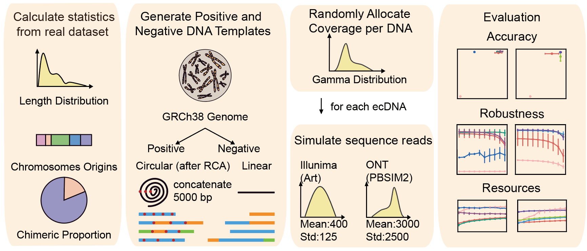

# Comparative analysis of methodologies for detecting extrachromosomal circular DNA

We created a Python pipeline called ecsim to simulate eccDNA datasets containing both circular and linear DNA from given data. 

## Getting Stared  
### Requirements
##### Note: To run this pipeline to generate simulated datasets, please ensure that `pysam`, `art`, and `pbsim2` have already been installed.
##### Create a environment to run ecsim. It would take several minutes to create the environment. 
```
conda env create -f enviroment.yaml 
```

### Installation
##### Note: It would take several minutes to install the software. 
```
cd $ecsim
pip install .
```

### Usage
##### Note: Please ensure that you have fasta files of reference genome and at least one profile bed files (either simple or chimeric) (containg 5 columns including 'chromatin start end length ecID' ), you can find example profile bed files in [Resource Directory](ecsim/ecsim/resource/).It would take hours to generate simulated dataset with 10000 circular and 10000 linear DNA, with a 5000bp extention of RCA and a sequencing depth of 50.  
```
ecsim --sample SAMPLE_NAME (required) \
      --reference REFERENCE_PATH (required) \
      --thread THREAD_NUMBER (required) \
      --path DATA_PATH (required) \
      --simple-profile SIMPLE_PROFILE_BEDFILE (containing 5 columns including `chromatin start end length ecID`) \
      --chimeric-profile CHIMERIC_PROFILE_BEDFILE (containing 5 columns including `chromatin start end length ecID`) \
      --simple-ratio SIMPLE_DNA_RATIO (default is calculated from profile) \
      --meancov SEQUENCING_DEPTH (default=25) \
      --circular-number CIRCULAR_DNA_NUMBER (default=10000) \
      --linear-number LINEAR_DNA_NUMBER (default=10000) \
      --amp AMPLIFIED_LENGTH (default=5000) \
      --seed RANDOM_SEED (default=None) \
      --ont-model PBSIM2_MODEL_NAME (default='R94') \
      --ont-mean ONT_READ_LENGTH_MEAN (default=3000) \
      --ont-std ONT_READ_LENGTH_STD (default=2500) \
      --sr-platform ILLUMINA_PLATFORM (default='HS25') \
      --sr-mean ILLUMINA_INSERT_LENGTH_MEAN (default=400) \
      --sr-std ILLUMINA_INSERT_LENGTH_STD (default=125) \
      --sr-readlen ILLUMINA_READ_LENGTH (default=150)
```
##### The pipeline will generate simulated fastq file from both `Illumina` and `Oxford Nanopore Technology` platform, fasta file of both circular and linear DNA and the annotation files including the coordinate and coverage of each DNA.

### Tutorial
* [1. Notebook for compare statistics between given data and simulated data]((scripts/001_Simulated_Visualization.ipynb))
* [2. shell scripts to run pipelines for eccDNA identification](scripts/000_Upstream_analysis_pipeline_detecting_eccDNA.ipynb)
* [3. Note book for evaluation of performance of pipelines for short-read data analysis](scripts/002_ShortRead_Evaluation.ipynb)
* [4. Note book for evaluation of performance of pipelines for short-read data analysis](scripts/003_LongRead_Evaluation.ipynb)

## Latest updates
### version 1.0.0 Nov 2013
upload ecsim for simulated eccDNA datasets
