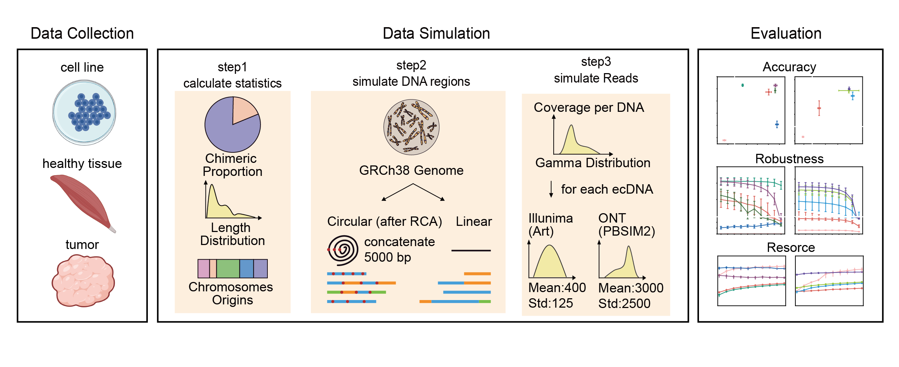

# Comparative analysis of methodologies for detecting eccDNA


Implementation description
We collected 7 eccDNA datasets and designed a pipeline to simulate eccDNA data generated by eccDNA-enriched experimental methods.

## Getting Stared
* [Requirements](#requirements)
* [Installation](#Installation)
* [Tutorial](#Tutorial)
* Notebook  
  * [1. Notebook for Simulated Generation and Statistics Comparation](notebook/01_01_Generate_Simulatated_Datasets.ipynb)
  * [2. Notebook for Short-Read Pipeline Evalation](notebook/01_02_Evaluate_ShortRead_Pipelines.ipynb)
  * [3. Notebook for Long-Read Pipeline Evalation](notebook/01_02_Evaluate_LongRead_Pipelines.ipynb)
  * [4. Notebook for Computational Resources Evaluation](notebook/01_03_Evaluate_Computational_Resources.ipynb)
  * [5. Notebook for 0-2kb, 2-10kb, >10kb and ecDNA Comparation](notebook/02_01_Statistics_Experiment_eccDNA.ipynb)
  * [6. Notebook for Coding Gene - ecDNA Correlation](notebook/02_02_CodingGene_eccDNA_Density.ipynb)
  * [7. Notebook for Highly-Correlate eccDNA Comparison](notebook/03_01_Compare_eccDNA_sequence.ipynb)
  * [8. Notebook for Oncogene Comparison](notebook/03_02_Compare_eccDNA_Oncogene.ipynb)
  * [9. Notebook for RepeatMask Comparison](notebook/03_03_Compare_RepeatMask_reads.ipynb)
## Latest updates
### version 1.0.1 May 2024
- Fix a bug in class `seqsim` that can not simulate data with only simple or chimeric eccDNA template.
- Package the pipeline using setuptools
### version 1.0.0 Nov 2023
- Upload ecsim for simulated eccDNA datasets

## Requirements
#### Note: To run this pipeline to simulate data, please ensure that `pysam`, `art`, `seqkit`, and `pbsim2` have already been installed.
It would take several minutes to create the environment. 
```
git clone https://github.com/QuKunLab/eccDNABenchmarking.git
cd eccDNABenchmarking/ecsim
conda env create -f environment.yaml
```
or
```
conda create -n ecsim -c bioconda pysam pbsim2 art seqkit python=3.9
```
## Installation
```
conda activate ecsim
cd eccDNABenchmarking/ecsim
pip install .
```
## Tutorial
#### Note: Parameters `sample`,`reference`,`thread`,`path` are required.
It would take hours to generate simulated dataset with 10000 circular and 10000 linear DNA, with a 5000bp extention of RCA and a sequencing depth of 50.  
```
ecsim --sample SAMPLE_NAME (required) \
      --reference REFERENCE_PATH (required) \
      --thread THREAD_NUMBER (required) \
      --path DATA_PATH (required) \
      --simple-template SIMPLE_TEMPLATE_BEDFILE (Alternative) \
      --chimeric-template CHIMERIC_TEMPLATE_BEDFILE (Alternative) \
      --simple-ratio SIMPLE_DNA_RATIO (default is calculated from profile) \
      --meancov SEQUENCING_DEPTH (default=25) \
      --circular-number CIRCULAR_DNA_NUMBER (default=10000) \
      --linear-number LINEAR_DNA_NUMBER (default=10000) \
      --amp AMPLIFIED_LENGTH (default=5000) \
      --seed RANDOM_SEED (default=None) \
      --ont-model PBSIM2_MODEL_NAME (default='R94') \
      --ont-mean ONT_READ_LENGTH_MEAN (default=3000) \
      --ont-std ONT_READ_LENGTH_STD (default=2500) \
      --sr-platform ILLUMINA_PLATFORM (default='HS25') \
      --sr-mean ILLUMINA_INSERT_LENGTH_MEAN (default=400) \
      --sr-std ILLUMINA_INSERT_LENGTH_STD (default=125) \
      --sr-readlen ILLUMINA_READ_LENGTH (default=150)
```
The template bed files (data used in this project) are stored in [resource directory](ecsim/ecsim/resource/template). If you not specify template files, default `simple_template` is template.simple.bed and default `chimeric_template` is template.chimeric.bed.


